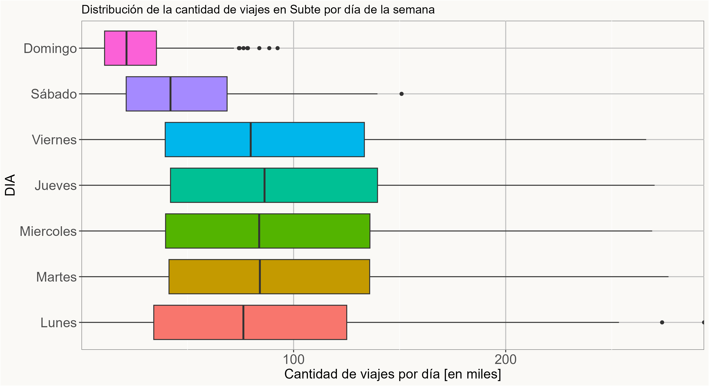

# 🚇 ¿Cómo afectan los tarifazos a la cantidad de pasajeros del Subte?

Este proyecto analiza el impacto de los aumentos tarifarios en el uso del Subte en el AMBA, combinando datos reales de viajes (SUBE), tarifas históricas y salarios (RIPTE). El foco del trabajo está en estudiar si el encarecimiento del pasaje se asocia con cambios en la cantidad de pasajeros, usando una variable de accesibilidad económica: `sueldo/tarifa`.

Es una versión refactorizada de un trabajo práctico de Introducción a la Ciencia de Datos, reorganizada como proyecto de portfolio para mostrar un flujo completo de análisis de datos: limpieza, análisis exploratorio, modelado y comunicación de resultados. 

---

## 📌 Objetivo

Responder la pregunta:

> ¿Cómo impactan los aumentos de tarifas en la cantidad de pasajeros del Subte?

El análisis se enfoca específicamente en el Subte porque, dentro del período estudiado, fue el medio de transporte cuya tarifa más aumentó en términos nominales y también ajustada por inflación. Además, en la presentación original del trabajo se señala que fue el único transporte público cuya suba tarifaria superó a la inflación en el período analizado. 

---

## 📊 Datos utilizados

Se integran tres fuentes principales:

- **SUBE (usos diarios)**: viajes por día, línea, empresa y tipo de transporte.
- **Tarifas históricas**: tabla construida para seguir la evolución del valor del pasaje.
- **RIPTE**: serie salarial utilizada para construir la variable `sueldo/tarifa`. 

A nivel general, el dataset original del trabajo quedó compuesto por **850643 observaciones**, **29 variables** y **3 medios de transporte**: Subte, Tren y Colectivo. 

---

## 📦 Dataset

El dataset principal se construyó integrando varias fuentes con granularidades distintas.

La base de viajes proviene de los registros diarios de SUBE, que incluyen cantidad de viajes por fecha, línea, empresa y tipo de transporte. A esa información se le sumó una tabla de tarifas históricas y una serie salarial basada en RIPTE, para construir variables económicas que permitan analizar accesibilidad. 

A partir de esa integración se generaron dos niveles de trabajo:

### Dataset diario

Se utilizó para la limpieza inicial, la exploración y la detección de patrones.

Incluye variables como:

- fecha
- año-mes
- día de la semana
- línea
- cantidad de viajes
- tarifa
- salario promedio
- sueldo/tarifa

### Dataset mensual modelado

Se construyó agrupando los viajes por línea y por mes.

Cada fila representa:

- una línea de Subte
- en un mes determinado
- con su cantidad total de viajes
- y su contexto económico asociado

Este nivel de agregación se usó para el modelado estadístico. La presentación original del trabajo remarca explícitamente que para el modelado cada observación representa los viajes de una línea en un mes determinado. 

### Principales transformaciones realizadas

- integración de archivos anuales de SUBE
- corrección de duplicados por cambio de concesión
- filtrado de fines de semana
- exclusión de meses con fuerte estacionalidad
- recorte del período afectado por pandemia
- construcción de la variable `sueldo/tarifa`

---

## 🧹 Limpieza y preparación de datos

Antes de modelar, se aplicaron varias decisiones clave para hacer el análisis más estable y comparable:

- se filtró solo AMBA
- se corrigieron duplicados por el cambio de concesión entre Metrovías y Emova en noviembre y diciembre de 2021
- se eliminaron sábados y domingos
- se excluyeron las líneas con muy bajo volumen de viajes
- se excluyeron enero, febrero y diciembre por estacionalidad
- se recortó el período más afectado por pandemia
- se construyó la variable `sueldo/tarifa` como proxy de accesibilidad económica

En la presentación del proyecto se justifica conservar los datos de **Metrovías para noviembre de 2021** y los de **Emova para diciembre de 2021**, porque las observaciones aparecían duplicadas por el cambio de concesión. También se explica la exclusión de fines de semana, de las tres líneas menos significativas y del tramo más afectado por la pandemia. 

---

## 📈 Análisis exploratorio (EDA)

Se analizaron distintos patrones en los datos para entender mejor la dinámica del uso del Subte:

- distribución de viajes por línea
- diferencias entre días de la semana
- evolución temporal del uso del Subte
- relación entre accesibilidad (`sueldo/tarifa`) y cantidad de viajes
- residuos de los modelos para detectar patrones no lineales

El análisis exploratorio mostró que algunas líneas aportaban poca información relevante, que los fines de semana introducían una dispersión innecesaria y que la pandemia y la estacionalidad afectaban fuertemente la serie temporal. También se observó una tendencia donde, a mayor cantidad de pasajes que puede comprar un salario promedio, mayor parece ser la cantidad de viajes. 

---

## 🤖 Modelado

Se compararon distintos modelos de regresión lineal, combinando variables como año, `sueldo/tarifa` y línea del Subte. La idea fue buscar un equilibrio entre interpretabilidad y capacidad predictiva.

Entre los modelos evaluados se incluyeron:

- modelos lineales simples
- modelos con año y `sueldo/tarifa`
- modelos con efecto por línea
- modelos con interacciones
- un modelo polinómico como mejora del modelo base

En la presentación original, el **Modelo 5** fue señalado como el mejor equilibrio entre simplicidad y capacidad predictiva, con un **R² = 0.9195**. Luego se propuso una mejora polinómica, cuyo ajuste subió a **R² = 0.9409**, validado además por ANOVA. 

---

## 📌 Resultados (resumen)

- La variable **`sueldo/tarifa`** tiene relación con la cantidad de viajes.
- Existen diferencias importantes entre líneas.
- El modelo con interacción captura mejor el comportamiento que los modelos más simples.
- El modelo polinómico mejora el ajuste, aunque pierde algo de interpretabilidad.
- Los residuos del Modelo 5 sugieren que una forma no lineal puede describir mejor el fenómeno. 

---

## 📌 Conclusiones

A partir del análisis exploratorio y del modelado, se observa que los aumentos tarifarios sí están asociados con cambios en la cantidad de pasajeros del Subte, pero el efecto no implica un abandono total del servicio.

La variable `sueldo/tarifa` resultó útil para capturar la accesibilidad económica del transporte. Cuando un salario promedio permite comprar menos pasajes, la cantidad de viajes tiende a disminuir.

También se observó que el impacto no es igual en todas las líneas. Las líneas con mayor volumen de pasajeros muestran variaciones más marcadas, mientras que otras presentan un comportamiento más estable.

En la comparación de modelos, las versiones más complejas mejoran el ajuste, pero el mejor equilibrio entre interpretabilidad y capacidad explicativa se encontró en el modelo con interacción entre año, `sueldo/tarifa` y línea.

En términos generales, el proyecto sugiere que el Subte sigue funcionando como un medio de transporte esencial: la demanda cae ante aumentos fuertes de tarifa, pero no desaparece. Esta misma idea aparece en la conclusión de la exposición oral: los usuarios reducen el uso, pero no abandonan completamente el servicio. 

---

## 🗂️ Fuentes de datos

Las fuentes utilizadas en este proyecto fueron:

- **SUBE / datos de transporte público**  
  Registros de viajes diarios por línea, empresa y tipo de transporte. [datos.gob.ar](https://datos.gob.ar/dataset/transporte-usos-sube)

- **Tarifas históricas del transporte**  
  Tabla armada a partir de relevamiento y reconstrucción de valores históricos.

- **RIPTE**  
  Remuneración Imponible Promedio de los Trabajadores Estables, utilizada para aproximar el salario promedio y construir la variable `sueldo/tarifa`. [argentina.gob.ar](https://www.argentina.gob.ar/trabajo/seguridadsocial/ripte)

- **IPC / inflación**  
  Utilizado como referencia para contextualizar aumentos tarifarios y actualizar valores dentro del análisis. [indec.gob.ar](https://www.indec.gob.ar/indec/web/Nivel4-Tema-3-5-31)

### Nota sobre las fuentes

Una parte importante del trabajo consistió en integrar y armonizar fuentes distintas, con formatos y frecuencias diferentes. Por eso, además del modelado, este proyecto también refleja un proceso real de limpieza, validación y construcción de variables analíticas. La exposición original destaca explícitamente que la reconstrucción de tarifas históricas fue una de las partes más complejas del trabajo. 

---

## 🧠 Qué muestra este proyecto

Este proyecto no muestra solo modelado. También muestra:

- trabajo con datos reales
- limpieza y decisiones analíticas
- integración de múltiples fuentes
- análisis exploratorio
- comparación de modelos
- refactorización de código para hacerlo más legible y reproducible

---

## 📂 Estructura del proyecto

```text
subte-fare-impact-portfolio/
│
├── data/
│   ├── raw/        # datos originales
│   └── processed/  # datasets limpios y listos para análisis
│
├── outputs/
│   ├── figures/    # gráficos
│   └── models/     # resultados de modelos
│
├── R/
│   ├── 00_install_packages.R
│   ├── 01_prepare_data.R
│   ├── 02_visual_parity_plots.R
│   ├── 03_modeling_visual_parity.R
│   ├── config.R
│   └── utils.R
│
├── run_project.R
├── LICENSE
└── README.md
```
---

## 📷 Ejemplos de visualizaciones



---

## 🚀 Sobre este repositorio

Este proyecto fue refactorizado a partir de un trabajo académico para:

* mejorar la legibilidad del código
* separar etapas del análisis
* hacerlo reproducible
* dejarlo listo como proyecto de portfolio

---

## 👤 Autor

Tiziano Stacchino
Estudiante de Ciencia de Datos

---

## 🔗 GitHub

*(https://github.com/tizianotichu/subte-tarifazos1.git)*

---

## 💬 Nota

El foco del proyecto es analítico y exploratorio.
No busca predecir perfectamente, sino entender el fenómeno.

---
